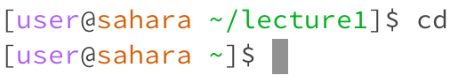
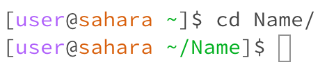
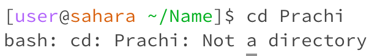
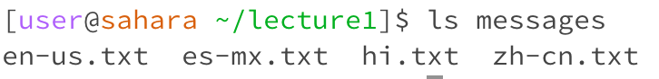
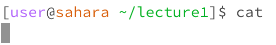
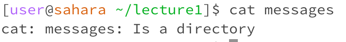
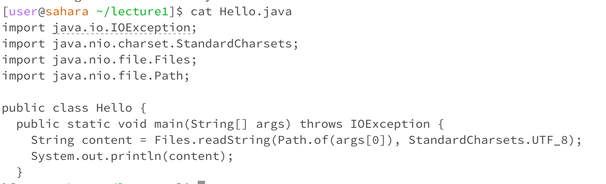

# Lab 1 Report

## Typing `cd` with _no arguments_

- working directory: `user@sahara ~/lecture1`
- using the `cd` command with no arguments returns the user to the home directory. In this case, we go back to the home directory after being in the lecture1 directory
- Not an error!

## Typing `cd` with path to a _directory_

- working directory: `user@sahara ~`
- using the `cd` command with a directory puts the user in the new directory as specified, which in this case is a folder lecture1.
- Not an error!

## Typing `cd` with a path to a _file_

- working directory: `user@sahara ~/lecture1`
- using the `cd` command with a file does not work, as cd stands for "change directory." Even though there is a file named Hello.java in the lecture1 folder, I cannot access it using `cd`.
- Error!

## Typing `ls` with _no arguments_

- working directory: `user@sahara ~/lecture1`
- using the `ls` command with no arguments shows all files and directories contained within the working directory. So within the lecture1 directory, we can see Hello.class, Hello.java. messages, and README
- Not an error!

## Typing `ls` with path to a _directory_
 
- working directory: `user@sahara ~/lecture1`
- using the `ls` command with a path to a directory will show all files and directories within the argument (which is also a directory). In this case, ls messages will show all the txt files that are in the messages folder.
- Not an error!

## Typing `ls` with a path to a _file_ 

- working directory: `user@sahara ~/lecture1`
- using the `ls` command with a path to a file will simply show the file itself. For example, when I used 'ls' with the argument as the file Hello.java, the output was Hello.java.
- Not an error!

## Typing `cat` with _no arguments_

- working directory: `user@sahara ~/lecture1`
- using the `cat` command with not run anything... it actually waits for an input from the keyboard. 
- Not an error!

## Typing `cat` with path to a _directory_
 
- working directory: `user@sahara ~/lecture1`
- using the `cat` command with a path to a directory will give an error saying that our argument is not a file. This error occurs again because there is no data to read from our argument because it is not a file!
- Error!

## Typing `cat` with a path to a _file_ 

- working directory: `user@sahara ~/lecture1`
- using the `cat` command with a path to a file will show the contents of the file. For example, when I used 'cat' with the argument as the file Hello.java, the output was the code within the Hello.java file. 
- Not an error!
