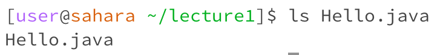

## Typing `cd` with _no arguments_

- working directory: user@sahara ~
- using the `cd` command with no arguments returns the user to the home directory. In this case, we are already in the home directory so nothing happened.
- Not an error!

## Typing `cd` with path to a _directory_

- working directory: user@sahara ~
- using the `cd` command with a directory puts the user in the new directory as specified, which in this case is a folder I created called Name.
- Not an error!

## Typing `cd` with a path to a _file_

- working directory: user@sahara ~
- using the `cd` command with a file does not work, as cd stands for "change directory." Even though I created a file named "Prachi" in my Name folder, I cannot access it using `cd`.
- Error!

## Typing `ls` with _no arguments_

- working directory: user@sahara ~/lecture1
- using the `ls` command with no arguments shows all files and directories contained within the working directory. So within the lecture1 directory we can see Hello.class, Hello.java. messages, and README
- Not an error!

## Typing `ls` with path to a _directory_
 
- working directory: user@sahara ~/lecture1
- using the `ls` command with a path to a directory will show all files and directories within the argument (which is also a directory). In this case, ls messages will show all the txt files that are in the messages folder.
- Not an error!

## Typing cd with a path to a _file_ 

- working directory: user@sahara ~/lecture1
- using the `ls` command with a path to a file will simply show the file itself. For example, when I used 'ls' with the argument as the file Hello.java, the output was Hello.java.
- Not an error!
