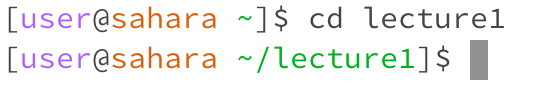
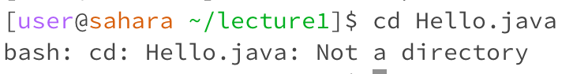

## Typing cd with _no arguments_

- working directory: user@sahara ~
- using the cd command with no arguments returns the user to the home directory. In this case, we are already in the home directory so nothing happened.
- Not an error!

## Typing cd with path to a _directory_

- working directory: user@sahara ~
- using the cd command with a directory puts the user in the new directory as specified, which in this case is a folder I created called Name.
- Not an error!

  ## Typing cd with a path to a _file_
  
- working directory: user@sahara ~
- using the cd command with a file does not work, as cd stands for "change directory." Even though I created a file named "Prachi" in my Name folder, I cannot access it using cd.
- Error!
