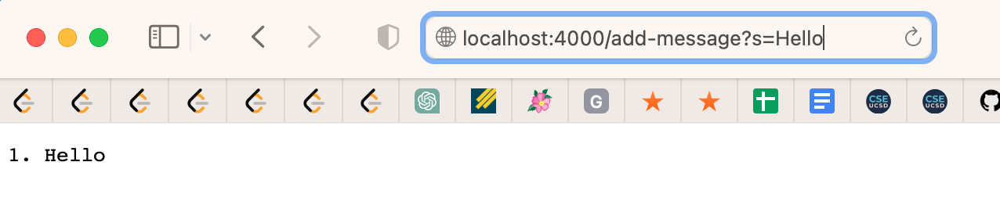
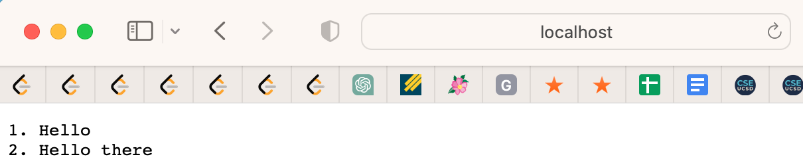
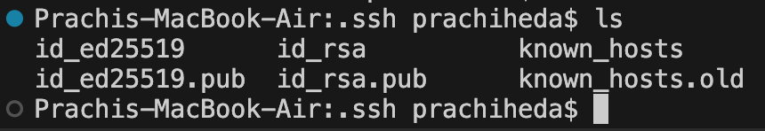

# Lab 2 Report

## Part 1
```
import java.io.IOException;
import java.net.URI;
import java.util.ArrayList;

class Handler implements URLHandler {
    // The one bit of state on the server: a number that will be manipulated by
    // various requests.
    ArrayList<String> strs = new ArrayList<>();
   
    

    public String handleRequest(URI url) {
            // if (strs.isEmpty()){
            //     return String.format("your list is empty");
            // }
            if (url.getPath().equals("/add-message")) {
                String[] parameters = url.getQuery().split("=");
                if (parameters[0].equals("s")) {
                    strs.add(parameters[1]);
                    String list = "";
                    int count = 1; 
                        for (String str:strs){
                            list= list + count + "." + " " + str + "\n"; 
                            count++; 
                        }
                        return String.format(list);
                    }
            }
            
            String list = "";
            for (String str:strs){
                list= list + " " + str; 
            }
            return String.format(list);
    }
    
}

class SearchEngine {
    public static void main(String[] args) throws IOException {
        if(args.length == 0){
            System.out.println("Missing port number! Try any number between 1024 to 49151");
            return;
        }

        int port = Integer.parseInt(args[0]);

        Server.start(port, new Handler());
    }
}

```


- the `handleRequest` function is called
- the relevant argument for `handleRequest` is the url of the page, which we can edit to add info. Within this method, there are 3 relevant fields. `String[] parameters` holds the query information (on either side of the = sign). `String list` is how I keep track of the query information to format. And `int count` allows me to increment and make a numbered list.
- `String[] parameters` changes completely depending on the url input. In this case, it should hold s in `parameters[0]` and Hello in `parameters[1]`. `String list` gets updated depending on it a new word is added to my ArrayList. It just holds 1. Hello in this case. `int count` increments every time the for loop is run to make a numbered list.


- the `handleRequest` function is called again 
- again the relevant argument for `handleReques` is the url of the page, which we can edit to add info. Within this method, there are 3 relevant fields. `String[] parameters` holds the query information (on either side of the = sign). `String list` is how I keep track of the query information to format. And `int count` allows me to increment and make a numbered list.
- `String[] parameters` changes completely depending on the url input. In this case, it should hold s in `parameters[0]` and Hello there in `parameters[1]`. `String list` gets updated depending on it a new word is added to my ArrayList. It holds 1. Hello 2. Hello there in this case. `int count` increments every time the for loop is run to make a numbered list.

## Part 2


- path to private key: /Users/prachiheda/.ssh/id_ed25519
- path to public key: /Users/prachiheda/.ssh/id_ed25519.pub


## Part 3

In week 3, I learned more about ssh into a remote server, specfically creating a private/public key to `ssh` into the ieng6 remote server without entering a password. I thought the `scp` command was interesting. `scp` stands for secure copy protocol, and it securely transfers files between two hosts. I would like to know more on how it securely does this process. 


