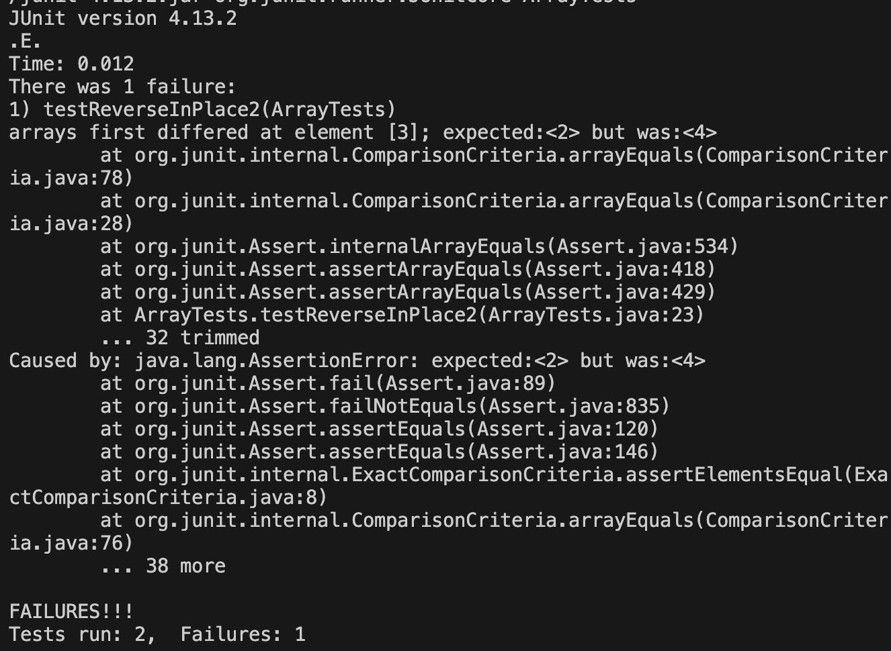

# Lab 3 Report

## Part 1

For this section, I am working with the reverseInPlace method, in the ArrayExamples file. 

### Failure inducing input: 
```
@Test 
public void testReverseInPlace2() {
    int[] input1 = { 1,2,3,4,5 };
    ArrayExamples.reverseInPlace(input1);
    assertArrayEquals(new int[]{ 5,4,3,2,1 }, input1);
}
```
### Non-failure inducing input: 
```
@Test 
public void testReverseInPlace() {
    int[] input1 = { 3 };
    ArrayExamples.reverseInPlace(input1);
    assertArrayEquals(new int[]{ 3 }, input1);
}
```
### Symptom: 


### Before and after fixed reverseInPlace method: 
Before: 
```
static void reverseInPlace(int[] arr) {
    for(int i = 0; i < arr.length; i += 1) {
      arr[i] = arr[arr.length - i - 1];
    }
}
```
After:
```
static void reverseInPlace(int[] arr) {
    for(int i = 0; i < arr.length/2; i += 1) {
      int temp = arr[i]; 
      arr[i] = arr[arr.length - i - 1];
      arr[arr.length-i-1] = temp; 
    }
}
```
We need to have another variable temp, and only iterate halfway through the array, and swap values on either side. Otherwise, the method is overwriting the original elements of the array as it iterates through it. This leads to all elements in the array becoming the last element of the original array.

## Part 2

For this section, I am working with the find command. 

### Option 1: -empty 
The -empty option searches for empty files and directories. Source: https://www.geeksforgeeks.org/find-command-in-linux-with-examples/

#### Using -empty on ./technical: 
```
Prachis-MacBook-Air:docsearch prachiheda$ find ./technical -empty
Prachis-MacBook-Air:docsearch prachiheda$
```
Makes sense! There are no empty directories or files in ./technical. 

#### Using -empty on ./technical (after adding an empty file to ./technical/biomed with the name empty.txt for testing purposes): 
```
Prachis-MacBook-Air:docsearch prachiheda$ find ./technical -empty
./technical/biomed/empty.txt
Prachis-MacBook-Air:docsearch prachiheda$
```
It works to find empty files in subdirectories of the parent directory. 

### Option 2: -newer 
The -newer option searches for files that were modified/created after another given file. Source: https://www.geeksforgeeks.org/find-command-in-linux-with-examples/

#### Using -newer on ./technical/911report with file chapter-1.txt: 
```
Prachis-MacBook-Air:docsearch prachiheda$ find ./technical/911report -newer ./technical/911report/chapter-1.txt
./technical/911report
./technical/911report/chapter-13.4.txt
./technical/911report/chapter-13.5.txt
./technical/911report/chapter-13.1.txt
./technical/911report/chapter-13.2.txt
./technical/911report/chapter-13.3.txt
./technical/911report/chapter-3.txt
./technical/911report/chapter-2.txt
./technical/911report/chapter-5.txt
./technical/911report/chapter-6.txt
./technical/911report/chapter-7.txt
./technical/911report/chapter-9.txt
./technical/911report/chapter-8.txt
./technical/911report/preface.txt
./technical/911report/chapter-12.txt
./technical/911report/chapter-10.txt
./technical/911report/chapter-11.txt
Prachis-MacBook-Air:docsearch prachiheda$ 
```
Makes sense! Chapters after chapter 1 will be created after chapter 1 is created. 

#### Using -newer on ./technical with directory ./technical/911report: 
```
Prachis-MacBook-Air:docsearch prachiheda$ find ./technical -newer ./technical/911report
./technical/government
./technical/government/About_LSC
./technical/government/Alcohol_Problems
./technical/government/Gen_Account_Office
./technical/government/Media
./technical/biomed
Prachis-MacBook-Air:docsearch prachiheda$ 
```
It works with directories as well! 

### Option 3: -user 
The -user option searches for file owned by username. Source: https://www.geeksforgeeks.org/find-command-in-linux-with-examples/

#### Using -user ucsd-cse15l-f23 on ./technical: 
```
Prachis-MacBook-Air:docsearch prachiheda$ find ./technical -user ucsd-cse15l-s23
find: -user: ucsd-cse15l-s23: no such user
Prachis-MacBook-Air:docsearch prachiheda$ 
```
Makes sense! There are no other users in this scenario, its on my personal github after I forked and cloned the original repo. 

#### Using -user prachiheda on ./technical/911report (there are too many files in just ./technical): 
```
Prachis-MacBook-Air:docsearch prachiheda$ find ./technical/911report -user pr
achiheda
./technical/911report
./technical/911report/chapter-13.4.txt
./technical/911report/chapter-13.5.txt
./technical/911report/chapter-13.1.txt
./technical/911report/chapter-13.2.txt
./technical/911report/chapter-13.3.txt
./technical/911report/chapter-3.txt
./technical/911report/chapter-2.txt
./technical/911report/chapter-1.txt
./technical/911report/chapter-5.txt
./technical/911report/chapter-6.txt
./technical/911report/chapter-7.txt
./technical/911report/chapter-9.txt
./technical/911report/chapter-8.txt
./technical/911report/preface.txt
./technical/911report/chapter-12.txt
./technical/911report/chapter-10.txt
./technical/911report/chapter-11.txt
Prachis-MacBook-Air:docsearch prachiheda$ 
```
Makes sense! I own all the files. 

### Option 4: -size 
The -size option searches for files based on specified size (less than, greater than, equal to). Source: https://tecadmin.net/linux-find-command-with-examples/

#### Using -size -512c on ./technical/biomed: 
```
Prachis-MacBook-Air:docsearch prachiheda$ find ./technical/biomed -size -512c
Prachis-MacBook-Air:docsearch prachiheda$ 
```
Looks like there are no files less than 512 bytes. 

#### Using -size +100k on ./technical/biomed: 
```
Prachis-MacBook-Air:docsearch prachiheda$ find ./technical/biomed -size +100k
./technical/biomed/1471-2105-3-2.txt
Prachis-MacBook-Air:docsearch prachiheda$ 
```
Seems like there is only one file that is greater than 100 KB. 
