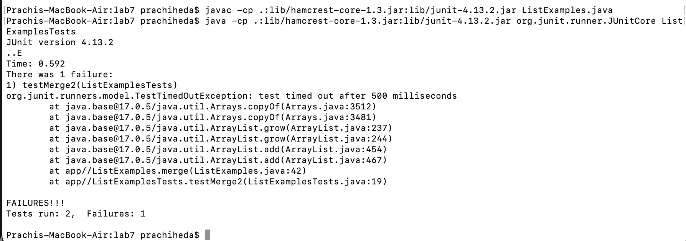

# Lab 4 

4. Keys Pressed: `ssh cs15lfa23jl@ieng6.ucsd.edu`, `<enter>`. I had to type out the entire command as I had exited the terminal previously. However, my password is saved, so no need to enter the password to login to ieng6

6. Keys Pressed: `git clone`,`Command-V`,`<enter>`. I had used `Command-C` earlier to copy the `SSH` URL, so I was able to paste it into my terminal.

7. Keys Pressed: `cd la`, `<tab>`, `<enter>`. This allowed me to change directory to `lab7/`. Then, `Command-C` to copy `javac -cp .:lib/hamcrest-core-1.3.jar:lib/junit-4.13.2.jar ListExamples.java` from my notes, and `Command-V`, `<enter>` to paste and compile Junit tests. Again, `Command-C` to copy `java -cp .:lib/hamcrest-core-1.3.jar:lib/junit-4.13.2.jar org.junit.runner.JUnitCore ListExamplesTests` from my notes, and `Command-V`,`L`,`<tab>`, `T`, `<tab>`, `j`, `<tab>`, `<enter>` to run Junit tests on `ListExamplesTest`.

8. Keys Pressed: `vim L`, `<tab>`, `.java`, `<enter>`. I open ListExamples.java in vim. Then, type `/change` to search for the comment that says to change index1 to index2. Then press `<down>` as the line to edit is one below. Then, `<right><right>` to access the number 1. Then, type `r2`, `<enter>` to replace with 2. Lastly, type `:wq`, `<enter>` to save and quit. As you can see in the screenshot, my cursor is hovering over 2 as that is the last thing I changed before save and quitting.

9. Keys Pressed: `<up><up><up><up><up><enter>`. The `javac -cp .:lib/hamcrest-core-1.3.jar:lib/junit-4.13.2.jar ListExamples.java` was 5 up in search history, so I used arrow to access it. Then, I pressed `<up><up><up><up><up><enter>`. The `java -cp .:lib/hamcrest-core-1.3.jar:lib/junit-4.13.2.jar org.junit.runner.JUnitCore ListExamplesTests` was also 5 up in history.

10. Keys Pressed: `git add "L"`, `<tab>`, `.java`, `<enter>`. First we need to add ListExamples.java to staging. Then `git commit -m"Changed index1 to index2"`, `<enter>`. I used the `-m` to write a message from the command line. Lastly, I typed `git push`, `<enter>`. This will push my changes to my repository. 

