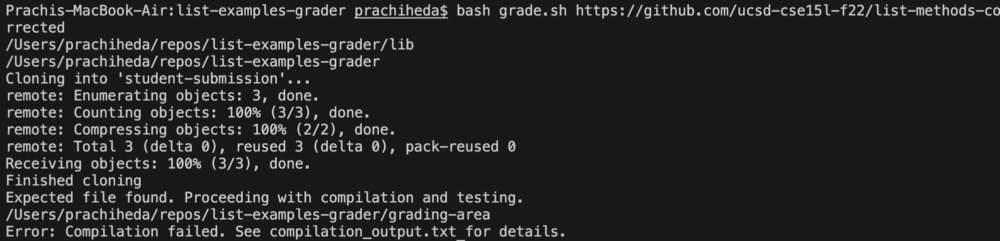
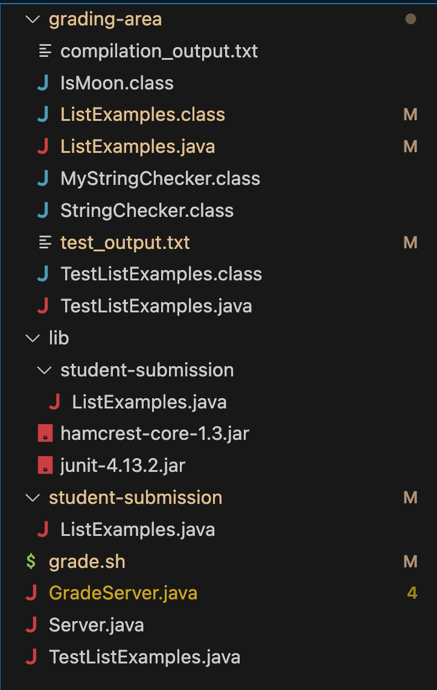

# Lab 5

## Part 1 - Debugging Scenario 

1. Student post: I created my grade.sh file for week 9 lab, but I am having some issues with running JUnit on the student submissions. I tested my grade.sh file on https://github.com/ucsd-cse15l-f22/list-methods-corrected, which is a repo that SHOULD pass all tests. However, this is my output:


This is what is in the compilation_output.txt file:

```
TestListExamples.java:1: error: package org.junit does not exist
import static org.junit.Assert.*;
                       ^
TestListExamples.java:2: error: package org.junit does not exist
import org.junit.*;
^
TestListExamples.java:24: error: cannot find symbol
  @Test(timeout = 500)
   ^
  symbol:   class Test
  location: class TestListExamples
TestListExamples.java:33: error: cannot find symbol
  @Test 
   ^
  symbol:   class Test
  location: class TestListExamples
TestListExamples.java:49: error: cannot find symbol
    @Test 
     ^
  symbol:   class Test
  location: class TestListExamples
TestListExamples.java:30: error: cannot find symbol
    assertEquals(expected, merged);
    ^
  symbol:   method assertEquals(List<String>,List<String>)
  location: class TestListExamples
TestListExamples.java:46: error: cannot find symbol
    assertEquals(expectedOutput, actualOutput);
    ^
  symbol:   method assertEquals(List<String>,List<String>)
  location: class TestListExamples
TestListExamples.java:63: error: cannot find symbol
        assertEquals(expectedOutput, actualOutput);
        ^
  symbol:   method assertEquals(List<String>,List<String>)
  location: class TestListExamples
8 errors
```

It seems like there is an issue with accessing JUnit. But I am unsure where to start as there are no hints in the compilation_output.txt file as to what is wrong in my grade.sh file. For reference, here is my grade.sh code: 

```
CPATH='.:lib/hamcrest-core-1.3.jar:lib/junit-4.13.2.jar'

rm -rf student-submission
rm -rf grading-area

mkdir grading-area

git clone $1 student-submission
echo 'Finished cloning'

if [ -e student-submission/ListExamples.java ]; then
    echo 'Expected file found. Proceeding with compilation and testing.'
    # Move student code and grading tests to grading-area
    cp -r student-submission/*.java grading-area/
    cp -r TestListExamples.java grading-area/
    # Change to grading-area directory
    cd grading-area
    javac -cp $CPATH *.java > compilation_output.txt 2>&1

    # Check the compilation status
    if [ $? -eq 0 ]; then
        echo 'Compilation successful. Proceeding with testing.'
        # Run JUnit tests and redirect the output to test_output.txt
        java -cp $CPATH org.junit.runner.JUnitCore TestListExamples > test_output.txt 2>&1

        # Check the test results using grep
         passed_tests=$(grep -o "OK ([0-9]\+ tests)" test_output.txt | grep -o "[0-9]\+")
         echo $passed_tests

        # Print the number of passed tests
        echo "Number of passed tests: $passed_tests"

        # Calculate the grade based on the number of passed tests
        if [ "$passed_tests" == "3" ]; then
            echo 'Grade: A'
        elif [ "$passed_tests" == "2" ]; then
            echo 'Grade: B'
        elif [ "$passed_tests" == "1" ]; then
            echo 'Grade: C'
        else
            echo 'Grade: F'
        fi

    else
        echo 'Error: Compilation failed. See compilation_output.txt for details.'
        exit 1  # Exit the script with an error code
    fi

else
    echo 'Error: Expected file not found in the student submission.'
    exit 1  # Exit the script with an error code
fi
```

2. TA response: Hi! Yes, looks like JUnit is not being accessed in your grade.sh file. Have you checked the directories where you compile tests versus where the JUnit class path is? (Hint, I mean the variable CPATH in your grade.sh file). You can check this out by using echo pwd at a few key points in your grade.sh file.

3. Student response: Thanks for the help! First, I added a few lines to my grade.sh file to figure out the where lib (the JUnit test info) is stored, versus the directory where I call JUnit, which is in the grading-area. This is what I added:

```
CPATH='.:lib/hamcrest-core-1.3.jar:lib/junit-4.13.2.jar'
cd lib
echo $PWD
cd ..
```
Above, I cd'ed into lib, printed the working directory, and then went back one directory so my code would work as normal. 

```
# Change to grading-area directory
cd grading-area
echo $PWD
javac -cp $CPATH *.java > compilation_output.txt 2>&1
```
Above, I also added an `echo $PWD` to find out where the working directory is for my grading-area. 

Here is my terminal output: 

I can see that the directory for lib is `/Users/prachiheda/repos/list-examples-grader/lib' and the directory for grading-area is /Users/prachiheda/repos/list-examples-grader/grading-area. I realize that I try to call my CPATH from inside grading-area, but my lib folder is not in grading-area, it is outside! So, to fix this bug, I would either have to add my lib folder inside grading-area or I could change my CPATH to go back one directory, and I decided the latter is easier. Now, my CPATH variable stores `CPATH='.:../lib/hamcrest-core-1.3.jar:../lib/junit-4.13.2.jar'`. Notice the `../` which allows me to go up one directory. Thank you for the help!

4. - After successfully running `bash grade.sh https://github.com/ucsd-cse15l-f22/list-methods-corrected`, this is what my directory structure looks like:


- before fixing the bug, my grade.sh file contained this: 
```
CPATH='.:lib/hamcrest-core-1.3.jar:lib/junit-4.13.2.jar'

rm -rf student-submission
rm -rf grading-area

mkdir grading-area

git clone $1 student-submission
echo 'Finished cloning'

if [ -e student-submission/ListExamples.java ]; then
    echo 'Expected file found. Proceeding with compilation and testing.'
    # Move student code and grading tests to grading-area
    cp -r student-submission/*.java grading-area/
    cp -r TestListExamples.java grading-area/
    # Change to grading-area directory
    cd grading-area
    javac -cp $CPATH *.java > compilation_output.txt 2>&1

    # Check the compilation status
    if [ $? -eq 0 ]; then
        echo 'Compilation successful. Proceeding with testing.'
        # Run JUnit tests and redirect the output to test_output.txt
        java -cp $CPATH org.junit.runner.JUnitCore TestListExamples > test_output.txt 2>&1

        # Check the test results using grep
         passed_tests=$(grep -o "OK ([0-9]\+ tests)" test_output.txt | grep -o "[0-9]\+")
         echo $passed_tests

        # Print the number of passed tests
        echo "Number of passed tests: $passed_tests"

        # Calculate the grade based on the number of passed tests
        if [ "$passed_tests" == "3" ]; then
            echo 'Grade: A'
        elif [ "$passed_tests" == "2" ]; then
            echo 'Grade: B'
        elif [ "$passed_tests" == "1" ]; then
            echo 'Grade: C'
        else
            echo 'Grade: F'
        fi

    else
        echo 'Error: Compilation failed. See compilation_output.txt for details.'
        exit 1  # Exit the script with an error code
    fi

else
    echo 'Error: Expected file not found in the student submission.'
    exit 1  # Exit the script with an error code
fi
```

- I ran `bash grade.sh https://github.com/ucsd-cse15l-f22/list-methods-corrected` to induce the bug.
- To fix the bug, all I had to edit was my JUnit CPATH to `CPATH='.:../lib/hamcrest-core-1.3.jar:../lib/junit-4.13.2.jar'`.

  
## Part 2 - Reflection
Something new that I learned this quarter was vim, and I really enjoyed using vim when it came to making small edits in my files. I had encountered vim by accident before taking this class, when committing a file to a git repo. Then it opened up the vim editor in my terminal, and I had no idea how to exit or escape it. Now that I know vim, adding commit messages to github is easy, even though I typically write it in the command line anyways. I think it is really cool that I accidentally encountered it before this class, and now I know what it is. 

